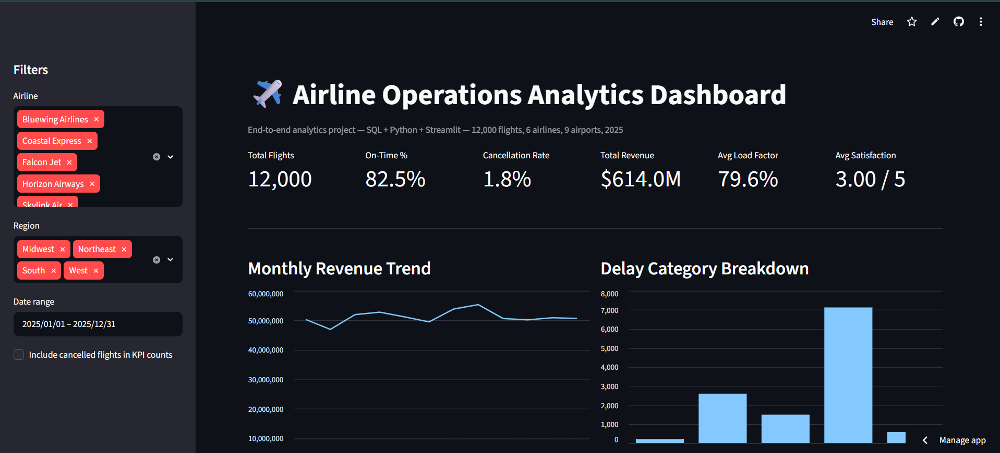
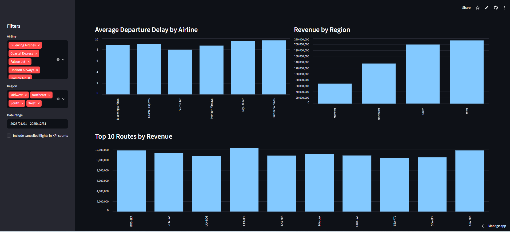
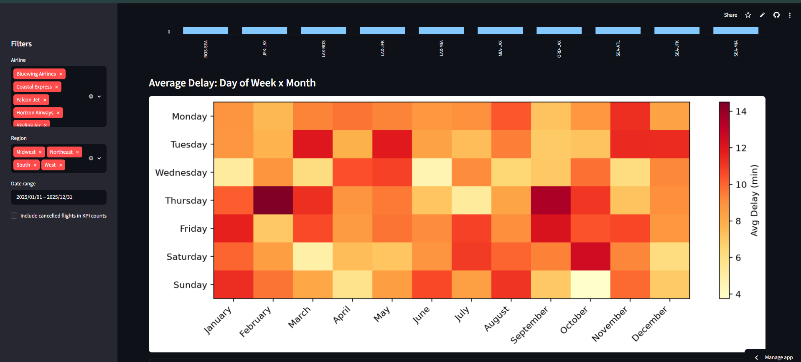
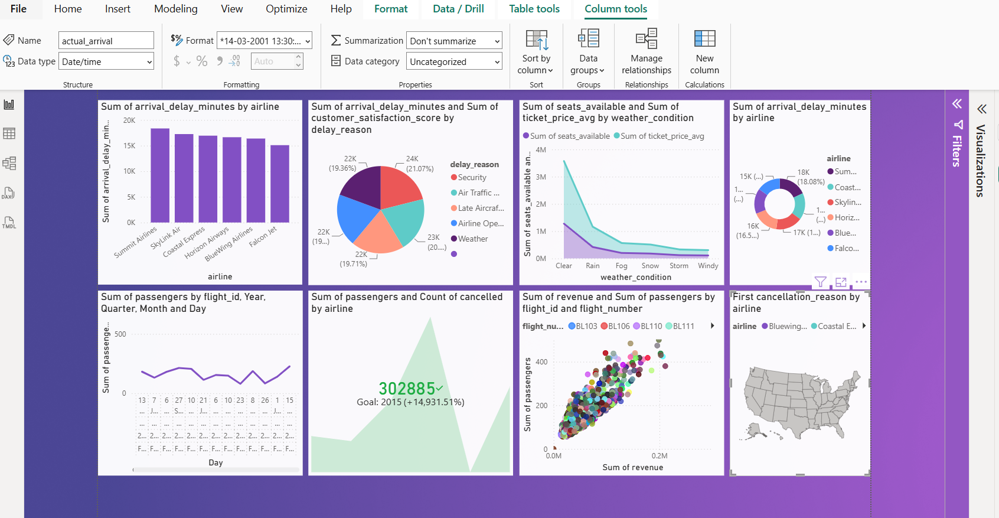

# ✈️ Airline Operations Analytics

End-to-end data analytics project analyzing 12,000 flights across 6 airlines and 9 airports — SQL, Python, and dashboards (Streamlit + Power BI), built like a real airline operations review.

**Live dashboard:** [Open on Streamlit](https://airline-operations-analytics-gvk82ud5cg3re7g6xp6evt.streamlit.app/)

---

## Business Problem
Airline operations leadership wants to know: where is on-time performance actually breaking down, which routes/regions drive revenue, and does flight delay really hurt customer satisfaction? This project answers all three with a full SQL + Python + dashboard workflow.

## Dataset
- `data/airline_flights_raw.csv` — raw, messy extract (duplicates, missing values)
- `data/airline_flights_clean.csv` — cleaned + feature-engineered (12,000 rows, 39 columns)
- `data/airports_dim.csv` — airport dimension table for joins
- `data/airline_ops.db` — SQLite version (for Power BI / Tableau)

One row = one flight. Key columns: airline, route, delay minutes, cancellation info, revenue, load factor, satisfaction score. Full column dictionary is in the code comments (`notebooks/01_data_cleaning.py`).

## Dashboard Preview

**Streamlit (live):**





**Power BI:**



## Tools
SQL (PostgreSQL/SQLite) · Python (Pandas, NumPy) · Matplotlib/Plotly · Power BI · Streamlit

## Workflow
1. `notebooks/00_generate_dataset.py` - generates raw data
2. `notebooks/01_data_cleaning.py` - cleans & engineers features
3. `notebooks/02_eda_visualizations.py` - builds charts
4. `notebooks/03_build_sqlite_db.py` - builds the SQLite database
5. `sql/01_schema.sql` + `sql/02_analysis_queries.sql` - 10 business SQL queries (joins, CTEs, window functions)
6. `app.py` - live Streamlit dashboard
7. `dashboard/power_bi_dashboard_design.md` - Power BI build spec

## Results
| Metric | Value |
|---|---|
| On-time performance | 82.5% |
| Cancellation rate | 1.8% |
| Total revenue | $614.0M |
| Avg load factor | 79.6% |
| Avg satisfaction | 3.0 / 5 |

Full findings and recommendations: [`reports/business_insights_and_recommendations.md`](reports/business_insights_and_recommendations.md)

## Installation
```bash
git clonehttps://github.com/Aruhi108/airline-operations-analytics.git
cd airline-operations-analytics
python -m venv venv
source venv/bin/activate      # Windows: venv\Scripts\activate
pip install -r requirements.txt

python notebooks/00_generate_dataset.py
python notebooks/01_data_cleaning.py
python notebooks/02_eda_visualizations.py
python notebooks/03_build_sqlite_db.py

streamlit run app.py
```

## Future Improvements
- Predictive delay model (logistic regression / XGBoost)
- Live weather API instead of simulated conditions
- Customer satisfaction driver analysis
- Automated pipeline with Airflow

## Project Structure

